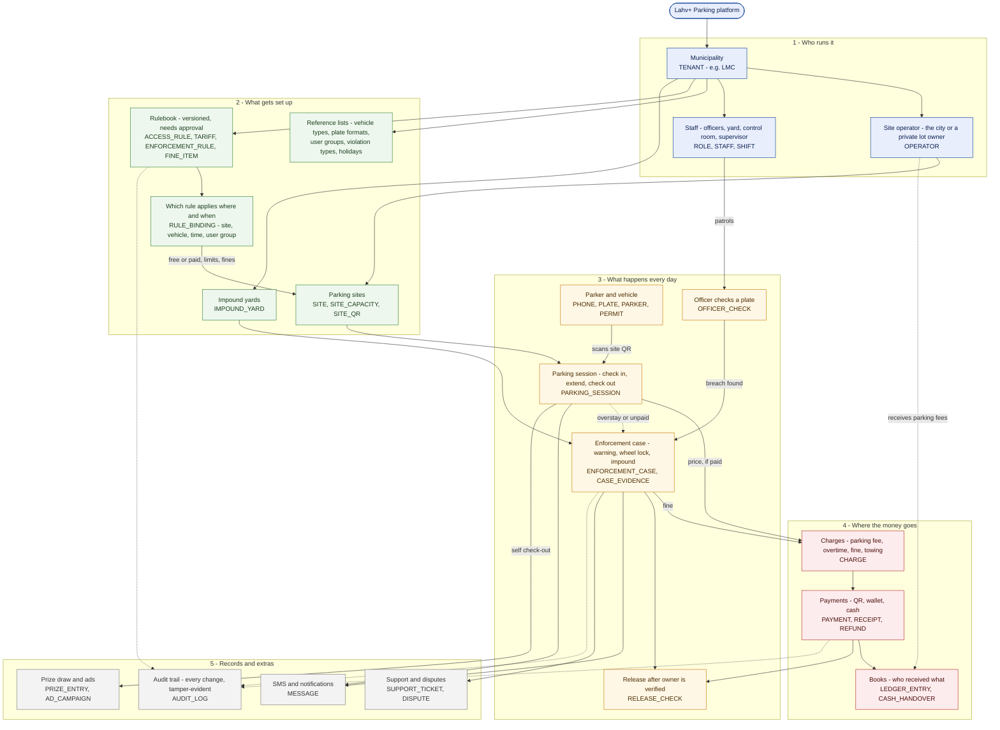

```mermaid
flowchart TD
  classDef cOrg fill:#e8eefc,stroke:#003893,color:#0b1f4d
  classDef cSetup fill:#eef7ee,stroke:#2e7d32,color:#1b3d1d
  classDef cOps fill:#fff7e6,stroke:#c77700,color:#4a2c00
  classDef cMoney fill:#fdecee,stroke:#b3261e,color:#4a0f0b
  classDef cRec fill:#f3f3f3,stroke:#777,color:#333

  PLAT(["Lahv+ Parking platform"]):::cOrg

  subgraph WHO["1 - Who runs it"]
    TEN["Municipality<br/>TENANT - e.g. LMC"]:::cOrg
    OPR["Site operator - the city or a private lot owner<br/>OPERATOR"]:::cOrg
    STAFF["Staff - officers, yard, control room, supervisor<br/>ROLE, STAFF, SHIFT"]:::cOrg
  end

  subgraph SETUP["2 - What gets set up"]
    LISTS["Reference lists - vehicle types, plate formats,<br/>user groups, violation types, holidays"]:::cSetup
    RULES["Rulebook - versioned, needs approval<br/>ACCESS_RULE, TARIFF, ENFORCEMENT_RULE, FINE_ITEM"]:::cSetup
    BIND["Which rule applies where and when<br/>RULE_BINDING - site, vehicle, time, user group"]:::cSetup
    SITE["Parking sites<br/>SITE, SITE_CAPACITY, SITE_QR"]:::cSetup
    YARD["Impound yards<br/>IMPOUND_YARD"]:::cSetup
  end

  subgraph DAILY["3 - What happens every day"]
    PARKER["Parker and vehicle<br/>PHONE, PLATE, PARKER, PERMIT"]:::cOps
    SESS["Parking session - check in, extend, check out<br/>PARKING_SESSION"]:::cOps
    CHECK["Officer checks a plate<br/>OFFICER_CHECK"]:::cOps
    CASE["Enforcement case - warning, wheel lock, impound<br/>ENFORCEMENT_CASE, CASE_EVIDENCE"]:::cOps
    REL["Release after owner is verified<br/>RELEASE_CHECK"]:::cOps
  end

  subgraph MONEY["4 - Where the money goes"]
    CHG["Charges - parking fee, overtime, fine, towing<br/>CHARGE"]:::cMoney
    PAY["Payments - QR, wallet, cash<br/>PAYMENT, RECEIPT, REFUND"]:::cMoney
    BOOKS["Books - who received what<br/>LEDGER_ENTRY, CASH_HANDOVER"]:::cMoney
  end

  subgraph EXTRAS["5 - Records and extras"]
    MSG["SMS and notifications<br/>MESSAGE"]:::cRec
    SUP["Support and disputes<br/>SUPPORT_TICKET, DISPUTE"]:::cRec
    PRIZE["Prize draw and ads<br/>PRIZE_ENTRY, AD_CAMPAIGN"]:::cRec
    AUDIT["Audit trail - every change, tamper-evident<br/>AUDIT_LOG"]:::cRec
  end

  PLAT --> TEN
  TEN --> OPR
  TEN --> STAFF
  TEN --> LISTS
  TEN --> RULES
  TEN --> YARD
  OPR --> SITE
  RULES --> BIND
  BIND -->|"free or paid, limits, fines"| SITE
  PARKER -->|"scans site QR"| SESS
  SITE --> SESS
  SESS -->|"price, if paid"| CHG
  STAFF -->|"patrols"| CHECK
  CHECK -->|"breach found"| CASE
  SESS -.->|"overstay or unpaid"| CASE
  YARD --> CASE
  CASE -->|"fine"| CHG
  CHG --> PAY
  PAY --> BOOKS
  PAY --> REL
  CASE --> REL
  OPR -.->|"receives parking fees"| BOOKS
  SESS --> MSG
  CASE --> MSG
  SESS -->|"self check-out"| PRIZE
  CASE --> SUP
  RULES -.-> AUDIT
  CASE -.-> AUDIT
  PAY -.-> AUDIT
```