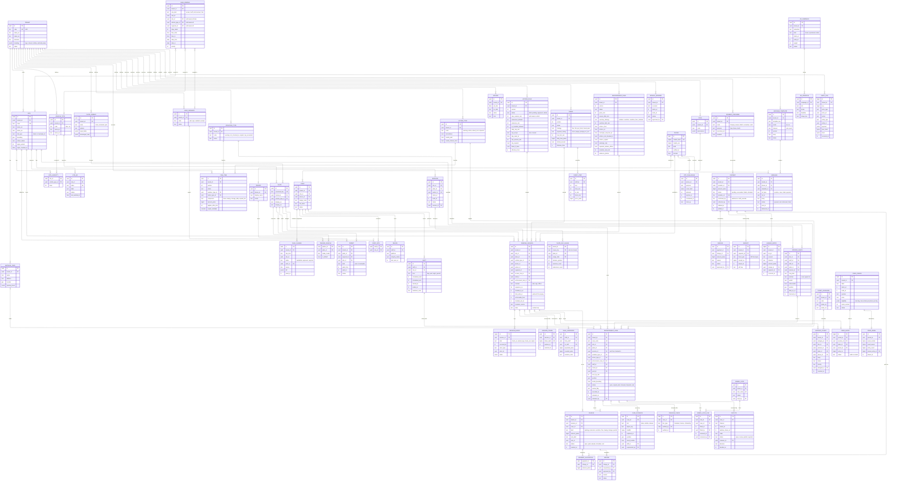

```mermaid
---
config:
  layout: elk
---
erDiagram
  %% ===== TENANCY AND PLACES =====
  TENANT {
    uuid id PK
    text code UK "LMC"
    text name_en
    text name_ne
    text timezone
    jsonb branding "logo, colours, hotline, authority name"
    text status
  }
  SITE {
    uuid id PK
    uuid tenant_id FK
    text code UK
    text name_en
    text name_ne
    text site_type "street or municipal_lot"
    geo boundary
    text rollout_status
    int signs_posted
    date signs_checked_at
  }
  SITE_CAPACITY {
    uuid site_id PK
    uuid vehicle_type_id PK
    int bays
  }
  SITE_QR {
    uuid id PK
    uuid site_id FK
    text token UK
    text label
    text status
    date last_audited_at
  }
  IMPOUND_YARD {
    uuid id PK
    uuid tenant_id FK
    text name
    text address
    geo location
    jsonb opening_hours
  }

  %% ===== REFERENCE DATA (per municipality) =====
  VEHICLE_TYPE {
    uuid id PK
    uuid tenant_id FK
    text code "bike, car"
    text name_en
    text name_ne
  }
  PLATE_FORMAT {
    uuid id PK
    uuid tenant_id FK
    text code "zone, provincial, govt"
    text pattern
    jsonb input_fields
    jsonb devanagari_map
  }
  USER_SEGMENT {
    uuid id PK
    uuid tenant_id FK
    text code "web, app, resident, exempt"
    text name
  }
  VIOLATION_TYPE {
    uuid id PK
    uuid tenant_id FK
    text code "overstay, not_checked_in, unpaid, cap_exceeded"
    text name
  }
  ACTION_TYPE {
    uuid id PK
    uuid tenant_id FK
    text code "warning, notice, wheel_lock, impound"
    bool immobilises
    bool needs_yard
    bool needs_release_docs
  }
  HOLIDAY {
    uuid id PK
    uuid tenant_id FK
    date ad_date
    text bs_date
    text name
    text kind
  }

  %% ===== RULES AND TARIFFS (versioned, approval-gated) =====
  ACCESS_RULE {
    uuid id PK
    uuid tenant_id FK
    int version
    text status "draft, pending, approved, retired"
    int max_session_min "null means no limit"
    int extensions_allowed
    int extension_min
    int re_checkins_allowed
    int daily_cap_min
    text cap_scope "site or tenant"
    time day_reset_at
    int min_session_min
    bool otp_required
    bool block_if_dues
    ts effective_from
  }
  TARIFF {
    uuid id PK
    uuid tenant_id FK
    int version
    text status
    text strategy "free, flat, per_block, tiered, pass"
    text payment_timing "none, prepay, postpay, on_exit"
    int free_first_min
    bigint daily_max_paisa
    bool refund_unused
    ts effective_from
  }
  TARIFF_STEP {
    uuid id PK
    uuid tariff_id FK
    int seq
    int from_min
    int to_min
    int block_min
    bigint price_paisa
  }
  ENFORCEMENT_RULE {
    uuid id PK
    uuid tenant_id FK
    int version
    text status
    int grace_min
    int severe_after_min
    text overstay_strategy "violation, overtime, overtime_then_violation"
    int overtime_limit_min
    time enforce_from
    time enforce_to
    time overnight_carryover_at
    bool enforce_not_checked_in
    bool enforce_unpaid
    bool warnings_only
    bool separate_release_officer
    int reminder_lead_min
    int evidence_photos
  }
  FINE_ITEM {
    uuid id PK
    uuid tenant_id FK
    int version
    text status
    uuid violation_type_id FK
    uuid action_type_id FK
    text component "base, towing, storage_daily, unpaid_fee"
    bigint amount_paisa
    int applies_after_min
    numeric repeat_multiplier
  }
  RULE_BINDING {
    uuid id PK
    uuid tenant_id FK
    text rule_kind "access, tariff, enforcement, fine"
    uuid rule_id
    uuid site_id FK "null means all sites"
    uuid vehicle_type_id FK "null means all"
    uuid segment_id FK "null means all"
    int days_mask
    time time_from
    time time_to
    date date_from
    date date_to
    int priority
  }
  RULE_CHANGE {
    uuid id PK
    uuid tenant_id FK
    text rule_kind
    uuid rule_id
    text action "submitted, approved, rejected"
    uuid actor_id FK
    text reason
    jsonb diff
    ts acted_at
  }
  SPECIAL_WINDOW {
    uuid id PK
    uuid tenant_id FK
    text occasion
    ts starts_at
    ts ends_at
    text status
    uuid approved_by FK
  }

  %% ===== PEOPLE AND IDENTITY =====
  PHONE {
    uuid id PK
    bytea msisdn_hash UK
    bytea msisdn_enc
    text last4
    ts verified_at
    bool blocked
  }
  PARKER {
    uuid id PK
    uuid phone_id FK
    text display_name
    text locale
  }
  PLATE {
    uuid id PK
    text canonical_key UK
    uuid format_id FK
    uuid vehicle_type_id FK
    text display_en
    text display_ne
  }
  PARKER_VEHICLE {
    uuid parker_id PK
    uuid plate_id PK
    text make_model
    bool is_default
  }
  PERMIT {
    uuid id PK
    uuid tenant_id FK
    uuid plate_id FK
    uuid segment_id FK
    uuid site_id FK
    text kind "pass or exemption"
    ts valid_from
    ts valid_to
    text status
  }
  OTP_CHALLENGE {
    uuid id PK
    uuid phone_id FK
    text purpose
    bytea code_hash
    int attempts
    ts expires_at
    ts consumed_at
    text client_ip
  }
  ROLE {
    uuid id PK
    uuid tenant_id FK
    text code
    jsonb permissions
  }
  STAFF {
    uuid id PK
    uuid tenant_id FK
    uuid role_id FK
    uuid phone_id FK
    text badge_code UK
    text full_name
    text status
  }
  STAFF_SITE {
    uuid staff_id PK
    uuid site_id PK
  }
  DEVICE {
    uuid id PK
    uuid staff_id FK
    text platform
    text integrity_status
    ts last_sync_at
  }
  SHIFT {
    uuid id PK
    uuid staff_id FK
    uuid site_id FK
    text kind "day, yard, night_special"
    ts scheduled_start
    ts scheduled_end
    ts started_at
    ts ended_at
    text handover_note
  }

  %% ===== SESSIONS =====
  PARKING_SESSION {
    uuid id PK
    uuid tenant_id FK
    uuid site_id FK
    uuid plate_id FK
    uuid vehicle_type_id FK
    uuid phone_id FK
    uuid parker_id FK
    uuid segment_id FK
    uuid access_rule_id FK
    uuid tariff_id FK
    uuid enforcement_rule_id FK
    text channel "web, app, officer"
    int sequence_no
    ts checked_in_at
    ts limit_ends_at "paid-until for prepay"
    ts enforceable_from
    ts checked_out_at
    text checkout_source
    text state "cached only"
  }
  SESSION_EVENT {
    bigint id PK
    uuid session_id FK
    text kind "check_in, extend, pay, check_out, expire"
    ts occurred_at
    text actor_type
    uuid actor_id
    jsonb detail
  }
  SESSION_TOKEN {
    uuid id PK
    uuid session_id FK
    bytea token_hash UK
    ts expires_at
    ts revoked_at
  }
  PLATE_DAY_USAGE {
    uuid tenant_id PK
    text scope_key PK "site id or tenant"
    uuid plate_id PK
    date usage_date PK
    int minutes_granted
    int sessions_count
    int extensions_count
  }
  BOOKING {
    uuid id PK
    uuid site_id FK
    uuid plate_id FK
    uuid parker_id FK
    ts starts_at
    ts ends_at
    text status
    uuid session_id FK
  }

  %% ===== MONEY =====
  CHARGE {
    uuid id PK
    uuid tenant_id FK
    uuid session_id FK
    uuid case_id FK
    text kind "parking, extension, overtime, fine, towing, storage, permit"
    bigint amount_paisa
    text rule_kind
    uuid rule_id
    text status "open, paid, waived, refunded, void"
    ts created_at
  }
  PAYMENT_PROVIDER {
    uuid id PK
    uuid tenant_id FK
    text code "fonepay, esewa, khalti, connectips, cash"
    text purpose "fees, fines or both"
    text merchant_ref
    bool enabled
  }
  PAYMENT {
    uuid id PK
    uuid tenant_id FK
    uuid provider_id FK
    bigint amount_paisa
    text status "pending, succeeded, failed, refunded"
    text provider_ref UK
    text confirmed_by "webhook or staff_override"
    uuid collected_by FK
    ts initiated_at
    ts settled_at
  }
  PAYMENT_ALLOCATION {
    uuid payment_id PK
    uuid charge_id PK
    bigint amount_paisa
  }
  REFUND {
    uuid id PK
    uuid payment_id FK
    uuid charge_id FK
    bigint amount_paisa
    text reason
    text status
    uuid approved_by FK
  }
  WAIVER {
    uuid id PK
    uuid charge_id FK
    uuid requested_by FK
    uuid approved_by FK
    text reason
    text status
  }
  RECEIPT {
    uuid id PK
    uuid tenant_id FK
    uuid payment_id FK
    text fiscal_year "BS fiscal year"
    bigint receipt_no
    ts issued_at
    text pdf_key
  }
  LEDGER_ENTRY {
    bigint id PK
    uuid tenant_id FK
    uuid txn_id
    text account
    text direction
    bigint amount_paisa
    uuid charge_id FK
    uuid payment_id FK
    ts occurred_at
  }
  CASH_HANDOVER {
    uuid id PK
    uuid shift_id FK
    uuid from_staff FK
    uuid to_staff FK
    bigint expected_paisa
    bigint counted_paisa
    text variance_note
  }

  %% ===== ENFORCEMENT =====
  OFFICER_CHECK {
    uuid id PK
    uuid site_id FK
    uuid staff_id FK
    uuid shift_id FK
    uuid plate_id FK
    uuid session_id FK
    text raw_plate
    text method "scan, typed, list"
    text verdict
    bool enforceable
    geo position
    ts data_as_of
    ts checked_at
  }
  ENFORCEMENT_CASE {
    uuid id PK
    uuid tenant_id FK
    text case_code UK
    uuid site_id FK
    uuid plate_id FK
    uuid session_id FK "null if not checked in"
    uuid violation_type_id FK
    uuid action_type_id FK
    uuid enforcement_rule_id FK
    uuid staff_id FK
    uuid check_id FK
    uuid yard_id FK
    int over_by_min
    geo position
    bool inside_boundary
    text status "open, unpaid, paid, released, disputed, void"
    text review_flag
    ts recorded_at
    ts released_at
    uuid released_by FK
  }
  CASE_EVIDENCE {
    uuid id PK
    uuid case_id FK
    text slot "plate, vehicle, release"
    text object_key
    bytea sha256
    ts captured_at
    geo position
    bool mock_location
    uuid staff_id FK
    uuid superseded_by FK
  }
  RELEASE_CHECK {
    uuid id PK
    uuid case_id FK
    text doc_type "bluebook, licence, citizenship"
    uuid verified_by FK
    ts verified_at
  }
  WHEEL_LOCK {
    uuid id PK
    uuid tenant_id FK
    text lock_code UK
    text status
    uuid held_by FK
  }
  WHEEL_LOCK_USE {
    uuid id PK
    uuid lock_id FK
    uuid case_id FK
    ts fitted_at
    uuid fitted_by FK
    ts removed_at
    uuid removed_by FK
  }
  DISPUTE {
    uuid id PK
    uuid case_id FK
    text channel
    ts raised_at
    ts window_closes_at
    text claim
    text status "open, review, upheld, rejected"
    uuid reviewer_id FK
    text decision
    ts decided_at
  }

  %% ===== MESSAGING AND SUPPORT =====
  MESSAGE_TEMPLATE {
    uuid id PK
    uuid tenant_id FK
    text template_key
    text locale "en, ne"
    text channel "sms, push"
    int version
    text body
    text status
  }
  MESSAGE {
    uuid id PK
    uuid tenant_id FK
    uuid phone_id FK
    uuid template_id FK
    text ref_type "session, case, ticket, payment"
    uuid ref_id
    text body
    text status "queued, sent, delivered, failed"
    ts sent_at
    ts delivered_at
  }
  TICKET_CATEGORY {
    uuid id PK
    uuid tenant_id FK
    text code
    text name_en
    text name_ne
  }
  SUPPORT_TICKET {
    uuid id PK
    uuid tenant_id FK
    uuid category_id FK
    uuid site_id FK
    uuid session_id FK
    uuid plate_id FK
    uuid phone_id FK
    text body
    text status
    text priority
    uuid assigned_to FK
    ts resolved_at
  }

  %% ===== ENGAGEMENT AND AUDIT =====
  PRIZE_PERIOD {
    uuid id PK
    uuid tenant_id FK
    text label
    ts starts_at
    ts ends_at
    text sponsor
    text prize
    jsonb eligibility "min stay, max entries per phone per day"
    int terms_version
    text status
  }
  PRIZE_ENTRY {
    bigint id PK
    uuid period_id FK
    uuid session_id FK
    uuid plate_id FK
    uuid phone_id FK
    bigint entry_no
    text status "valid or voided"
  }
  PRIZE_DRAW {
    uuid id PK
    uuid period_id FK
    bytea seed_commit
    bytea seed_reveal
    bigint entry_count
    bigint winner_entry_id FK
    ts drawn_at
  }
  AD_CAMPAIGN {
    uuid id PK
    uuid tenant_id FK
    text advertiser
    text kind "house, sponsored, notice"
    ts starts_at
    ts ends_at
    int weight
    text status
  }
  AD_CREATIVE {
    uuid id PK
    uuid campaign_id FK
    text slot
    text locale
    text headline
    text image_key
  }
  AUDIT_LOG {
    bigint id PK
    uuid tenant_id FK
    bigint seq
    text actor_type
    uuid actor_id
    text action
    text entity_type
    uuid entity_id
    jsonb payload
    bytea prev_hash
    bytea hash
    ts occurred_at
  }

  %% ===== RELATIONSHIPS =====
  TENANT ||--o{ SITE : "owns"
  SITE ||--o{ SITE_CAPACITY : "has"
  VEHICLE_TYPE ||--o{ SITE_CAPACITY : "counted in"
  SITE ||--o{ SITE_QR : "has"
  TENANT ||--o{ IMPOUND_YARD : "has"
  TENANT ||--o{ VEHICLE_TYPE : "defines"
  TENANT ||--o{ PLATE_FORMAT : "defines"
  TENANT ||--o{ USER_SEGMENT : "defines"
  TENANT ||--o{ VIOLATION_TYPE : "defines"
  TENANT ||--o{ ACTION_TYPE : "defines"
  TENANT ||--o{ HOLIDAY : "observes"

  TENANT ||--o{ ACCESS_RULE : "versions"
  TENANT ||--o{ TARIFF : "versions"
  TENANT ||--o{ ENFORCEMENT_RULE : "versions"
  TENANT ||--o{ FINE_ITEM : "versions"
  TARIFF ||--o{ TARIFF_STEP : "priced by"
  VIOLATION_TYPE ||--o{ FINE_ITEM : "fined by"
  ACTION_TYPE ||--o{ FINE_ITEM : "fined by"
  RULE_BINDING }o--o| SITE : "scoped to"
  RULE_BINDING }o--o| VEHICLE_TYPE : "scoped to"
  RULE_BINDING }o--o| USER_SEGMENT : "scoped to"
  STAFF ||--o{ RULE_CHANGE : "submits or approves"
  TENANT ||--o{ SPECIAL_WINDOW : "schedules"

  PLATE_FORMAT ||--o{ PLATE : "formats"
  VEHICLE_TYPE ||--o{ PLATE : "typed as"
  PHONE ||--o| PARKER : "belongs to"
  PARKER ||--o{ PARKER_VEHICLE : "saves"
  PLATE ||--o{ PARKER_VEHICLE : "saved as"
  PLATE ||--o{ PERMIT : "holds"
  USER_SEGMENT ||--o{ PERMIT : "grants"
  PHONE ||--o{ OTP_CHALLENGE : "verifies"
  TENANT ||--o{ ROLE : "defines"
  ROLE ||--o{ STAFF : "assigned"
  STAFF ||--o{ STAFF_SITE : "posted to"
  SITE ||--o{ STAFF_SITE : "staffed by"
  STAFF ||--o{ DEVICE : "uses"
  STAFF ||--o{ SHIFT : "works"

  SITE ||--o{ PARKING_SESSION : "hosts"
  PLATE ||--o{ PARKING_SESSION : "parks"
  PHONE |o--o{ PARKING_SESSION : "verified by"
  ACCESS_RULE ||--o{ PARKING_SESSION : "pinned"
  TARIFF ||--o{ PARKING_SESSION : "pinned"
  ENFORCEMENT_RULE ||--o{ PARKING_SESSION : "pinned"
  PARKING_SESSION ||--o{ SESSION_EVENT : "logs"
  PARKING_SESSION ||--o{ SESSION_TOKEN : "accessed by"
  PLATE ||--o{ PLATE_DAY_USAGE : "budgets"
  SITE ||--o{ BOOKING : "reserves"
  BOOKING |o--o| PARKING_SESSION : "becomes"

  PARKING_SESSION ||--o{ CHARGE : "incurs"
  ENFORCEMENT_CASE ||--o{ CHARGE : "incurs"
  TENANT ||--o{ PAYMENT_PROVIDER : "enables"
  PAYMENT_PROVIDER ||--o{ PAYMENT : "processes"
  PAYMENT ||--o{ PAYMENT_ALLOCATION : "split into"
  CHARGE ||--o{ PAYMENT_ALLOCATION : "settled by"
  PAYMENT ||--o{ REFUND : "reversed by"
  CHARGE ||--o{ WAIVER : "waived by"
  PAYMENT ||--o| RECEIPT : "evidenced by"
  PAYMENT ||--o{ LEDGER_ENTRY : "posts"
  SHIFT ||--o{ CASH_HANDOVER : "closes with"

  SITE ||--o{ OFFICER_CHECK : "patrolled"
  STAFF ||--o{ OFFICER_CHECK : "performs"
  OFFICER_CHECK |o--o| ENFORCEMENT_CASE : "leads to"
  PLATE ||--o{ ENFORCEMENT_CASE : "cited"
  PARKING_SESSION |o--o{ ENFORCEMENT_CASE : "breached in"
  VIOLATION_TYPE ||--o{ ENFORCEMENT_CASE : "classifies"
  ACTION_TYPE ||--o{ ENFORCEMENT_CASE : "applies"
  IMPOUND_YARD |o--o{ ENFORCEMENT_CASE : "holds"
  ENFORCEMENT_CASE ||--o{ CASE_EVIDENCE : "proven by"
  ENFORCEMENT_CASE ||--o{ RELEASE_CHECK : "released after"
  WHEEL_LOCK ||--o{ WHEEL_LOCK_USE : "fitted"
  ENFORCEMENT_CASE |o--o| WHEEL_LOCK_USE : "uses"
  ENFORCEMENT_CASE ||--o{ DISPUTE : "contested by"

  TENANT ||--o{ MESSAGE_TEMPLATE : "words"
  MESSAGE_TEMPLATE ||--o{ MESSAGE : "renders"
  PHONE ||--o{ MESSAGE : "receives"
  TICKET_CATEGORY ||--o{ SUPPORT_TICKET : "classifies"
  PARKING_SESSION |o--o{ SUPPORT_TICKET : "about"

  PRIZE_PERIOD ||--o{ PRIZE_ENTRY : "collects"
  PARKING_SESSION |o--o| PRIZE_ENTRY : "earns"
  PRIZE_PERIOD ||--o| PRIZE_DRAW : "decided by"
  AD_CAMPAIGN ||--o{ AD_CREATIVE : "shows"
  TENANT ||--o{ AUDIT_LOG : "records"
```