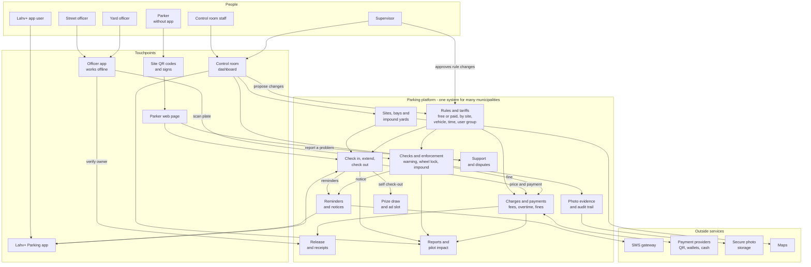

```mermaid
---
config:
  flowchart:
    curve: basis
    nodeSpacing: 30
    rankSpacing: 60
    htmlLabels: true
---
flowchart TB
  subgraph PEOPLE["People"]
    direction LR
    P["Parker<br/>without app"]
    AU["Lahv+ app user"]
    OF["Street officer"]
    YO["Yard officer"]
    CR["Control room staff"]
    SV["Supervisor"]
  end
  subgraph TOUCH["Touchpoints"]
    direction LR
    QR["Site QR codes<br/>and signs"]
    WEB["Parker web page"]
    APP["Lahv+ Parking app"]
    OAPP["Officer app<br/>works offline"]
    DASH["Control room<br/>dashboard"]
  end
  subgraph CORE["Parking platform - one system for many municipalities"]
    direction LR
    SITES["Sites, bays and<br/>impound yards"]
    RULES["Rules and tariffs<br/>free or paid, by site,<br/>vehicle, time, user group"]
    SESS["Check in, extend,<br/>check out"]
    PAY["Charges and payments<br/>fees, overtime, fines"]
    ENF["Checks and enforcement<br/>warning, wheel lock, impound"]
    EVID["Photo evidence<br/>and audit trail"]
    REL["Release<br/>and receipts"]
    NOTIFY["Reminders<br/>and notices"]
    SUP["Support<br/>and disputes"]
    ENG["Prize draw<br/>and ad slot"]
    REP["Reports and<br/>pilot impact"]
  end
  subgraph EXT["Outside services"]
    direction LR
    SMS["SMS gateway"]
    PSP["Payment providers<br/>QR, wallets, cash"]
    STORE["Secure photo<br/>storage"]
    MAP["Maps"]
  end

  P --> QR
  QR --> WEB
  WEB --> SESS
  AU --> APP
  APP --> SESS
  SITES --> SESS
  RULES --> SESS
  RULES --> PAY
  RULES --> ENF
  SESS -->|"price and payment"| PAY
  SESS -->|"reminders"| NOTIFY
  SESS -->|"self check-out"| ENG
  OF --> OAPP
  OAPP -->|"scan plate"| ENF
  ENF --> EVID
  ENF -->|"fine"| PAY
  ENF -->|"notice"| NOTIFY
  YO --> OAPP
  OAPP -->|"verify owner"| REL
  PAY --> REL
  PAY <--> PSP
  NOTIFY --> SMS
  NOTIFY --> APP
  EVID --> STORE
  WEB -->|"report a problem"| SUP
  CR --> DASH
  SV --> DASH
  DASH --> SITES
  DASH -->|"propose changes"| RULES
  SV -->|"approves rule changes"| RULES
  DASH --> SUP
  DASH --> REP
  SESS --> REP
  ENF --> REP
  PAY --> REP
  SITES --> MAP
```