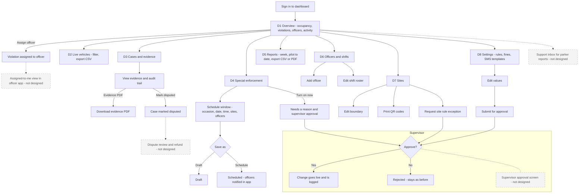

```mermaid
flowchart TD
  classDef pending fill:#f4f4f4,stroke:#999,stroke-dasharray: 5 5,color:#555

  C0["Sign in to dashboard"] --> D1["D1 Overview - occupancy, violations, officers, activity"]
  D1 -->|"Assign officer"| ASSIGN["Violation assigned to officer"]
  ASSIGN -.-> ASSIGNAPP["Assigned-to-me view in officer app - not designed"]:::pending
  D1 --> D2["D2 Live vehicles - filter, export CSV"]
  D1 --> D3["D3 Cases and evidence"]
  D3 --> D3a["View evidence and audit trail"]
  D3a -->|"Evidence PDF"| PDF["Download evidence PDF"]
  D3a -->|"Mark disputed"| DISP["Case marked disputed"]
  DISP -.-> DREV["Dispute review and refund - not designed"]:::pending
  D1 --> D4["D4 Special enforcement"]
  D4 --> D4a["Schedule window - occasion, date, time, sites, officers"]
  D4a --> D4b{"Save as"}
  D4b -->|"Draft"| DRAFT["Draft"]
  D4b -->|"Schedule"| SCHED["Scheduled - officers notified in app"]
  D4 -->|"Turn on now"| D4c["Needs a reason and supervisor approval"]
  D1 --> D5["D5 Reports - week, pilot to date, export CSV or PDF"]
  D1 --> D6["D6 Officers and shifts"]
  D6 --> D6a["Add officer"]
  D6 --> D6b["Edit shift roster"]
  D1 --> D7["D7 Sites"]
  D7 --> D7a["Edit boundary"]
  D7 --> D7b["Print QR codes"]
  D7 --> D7c["Request site rule exception"]
  D1 --> D8["D8 Settings - rules, fines, SMS templates"]
  D8 --> D8a["Edit values"]
  D8a --> D8b["Submit for approval"]
  D1 -.-> INBOX["Support inbox for parker reports - not designed"]:::pending

  subgraph SUPV["Supervisor"]
    APPR{"Approve?"}
    LIVE["Change goes live and is logged"]
    REJ["Rejected - stays as before"]
    SUPSCREEN["Supervisor approval screen - not designed"]:::pending
  end
  D8b --> APPR
  D4c --> APPR
  D7c --> APPR
  APPR -->|"Yes"| LIVE
  APPR -->|"No"| REJ
  APPR -.- SUPSCREEN
```