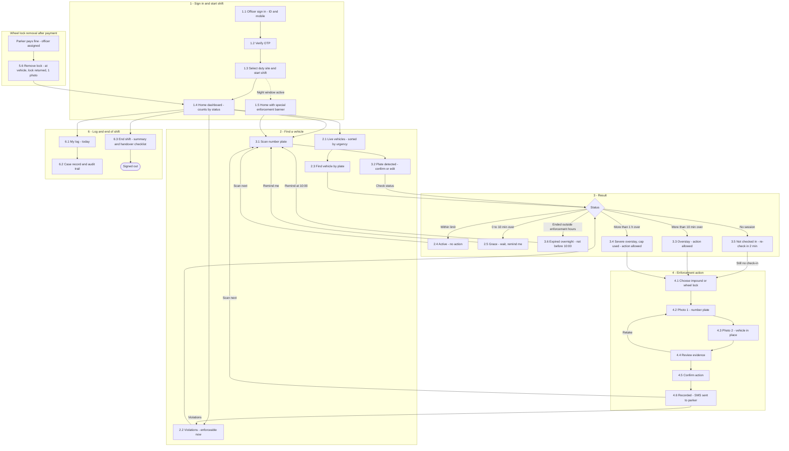

```mermaid
flowchart TD
  subgraph START["1 - Sign in and start shift"]
    O11["1.1 Officer sign in - ID and mobile"] --> O12["1.2 Verify OTP"]
    O12 --> O13["1.3 Select duty site and start shift"]
    O13 --> O14["1.4 Home dashboard - counts by status"]
    O13 -.->|"Night window active"| O15["1.5 Home with special enforcement banner"]
  end

  subgraph FIND["2 - Find a vehicle"]
    O21["2.1 Live vehicles - sorted by urgency"]
    O22["2.2 Violations - enforceable now"]
    O23["2.3 Find vehicle by plate"]
    O31["3.1 Scan number plate"]
    O32["3.2 Plate detected - confirm or edit"]
  end
  O14 --> O31
  O14 --> O22
  O14 --> O21
  O15 --> O31
  O21 --> O23
  O31 --> O32

  subgraph VERDICT["3 - Result"]
    V{"Status"}
    O24["2.4 Active - no action"]
    O25["2.5 Grace - wait, remind me"]
    O36["3.6 Expired overnight - not before 10:00"]
    O35["3.5 Not checked in - re-check in 2 min"]
    O33["3.3 Overstay - action allowed"]
    O34["3.4 Severe overstay, cap used - action allowed"]
  end
  O32 -->|"Check status"| V
  O22 --> V
  O23 --> V
  V -->|"Within limit"| O24
  V -->|"0 to 10 min over"| O25
  V -->|"Ended outside enforcement hours"| O36
  V -->|"No session"| O35
  V -->|"More than 10 min over"| O33
  V -->|"More than 1 h over"| O34
  O24 -->|"Scan next"| O31
  O25 -->|"Remind me"| O31
  O36 -->|"Remind at 10:00"| O31
  O35 -->|"Still no check-in"| O41
  O33 --> O41
  O34 --> O41

  subgraph ACT["4 - Enforcement action"]
    O41["4.1 Choose impound or wheel lock"]
    O42["4.2 Photo 1 - number plate"]
    O43["4.3 Photo 2 - vehicle in place"]
    O44["4.4 Review evidence"]
    O45["4.5 Confirm action"]
    O46["4.6 Recorded - SMS sent to parker"]
  end
  O41 --> O42
  O42 --> O43
  O43 --> O44
  O44 -->|"Retake"| O42
  O44 --> O45
  O45 --> O46
  O46 -->|"Scan next"| O31
  O46 -->|"Violations"| O22

  subgraph LOCK["Wheel lock removal after payment"]
    PAID["Parker pays fine - officer assigned"]
    O56["5.6 Remove lock - at vehicle, lock returned, 1 photo"]
  end
  PAID --> O56
  O56 --> O14

  subgraph CLOSE["6 - Log and end of shift"]
    O61["6.1 My log - today"]
    O62["6.2 Case record and audit trail"]
    O63["6.3 End shift - summary and handover checklist"]
    OUT(["Signed out"])
  end
  O14 --> O61
  O61 --> O62
  O14 --> O63
  O63 --> OUT
```