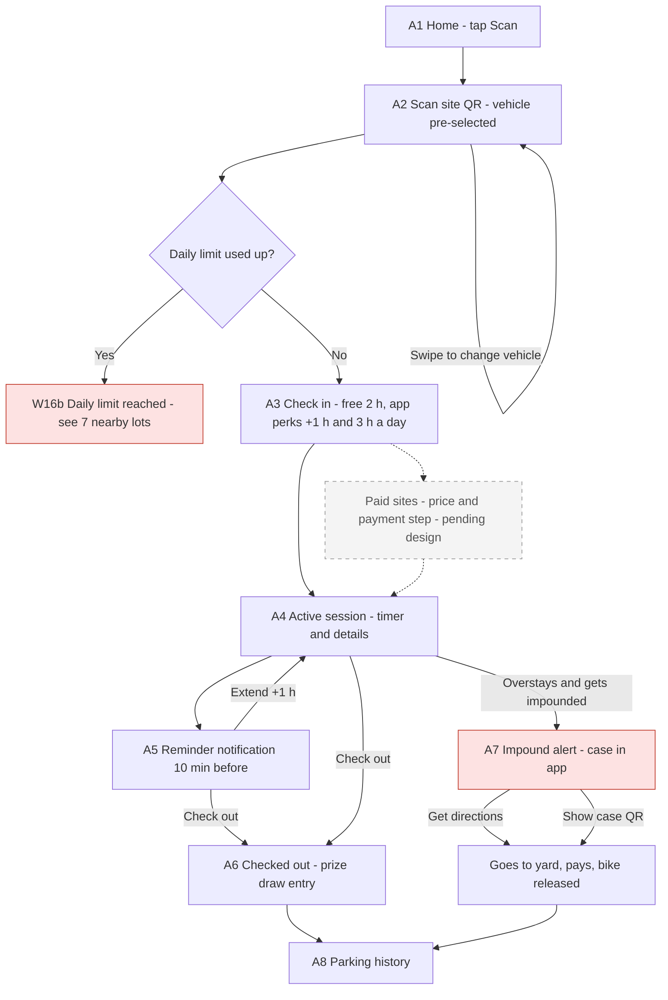

```mermaid
flowchart TD
  classDef pending fill:#f4f4f4,stroke:#999,stroke-dasharray: 5 5,color:#555
  classDef bad fill:#fde2e2,stroke:#c0392b,color:#333

  A1["A1 Home - tap Scan"] --> A2["A2 Scan site QR - vehicle pre-selected"]
  A2 -->|"Swipe to change vehicle"| A2
  A2 --> DL{"Daily limit used up?"}
  DL -->|"Yes"| W16b["W16b Daily limit reached - see 7 nearby lots"]:::bad
  DL -->|"No"| A3["A3 Check in - free 2 h, app perks +1 h and 3 h a day"]
  A3 -.-> PAY["Paid sites - price and payment step - pending design"]:::pending
  A3 --> A4["A4 Active session - timer and details"]
  PAY -.-> A4
  A4 --> A5["A5 Reminder notification 10 min before"]
  A5 -->|"Extend +1 h"| A4
  A5 -->|"Check out"| A6["A6 Checked out - prize draw entry"]
  A4 -->|"Check out"| A6
  A6 --> A8["A8 Parking history"]
  A4 -->|"Overstays and gets impounded"| A7["A7 Impound alert - case in app"]:::bad
  A7 -->|"Get directions"| YARD["Goes to yard, pays, bike released"]
  A7 -->|"Show case QR"| YARD
  YARD --> A8
```