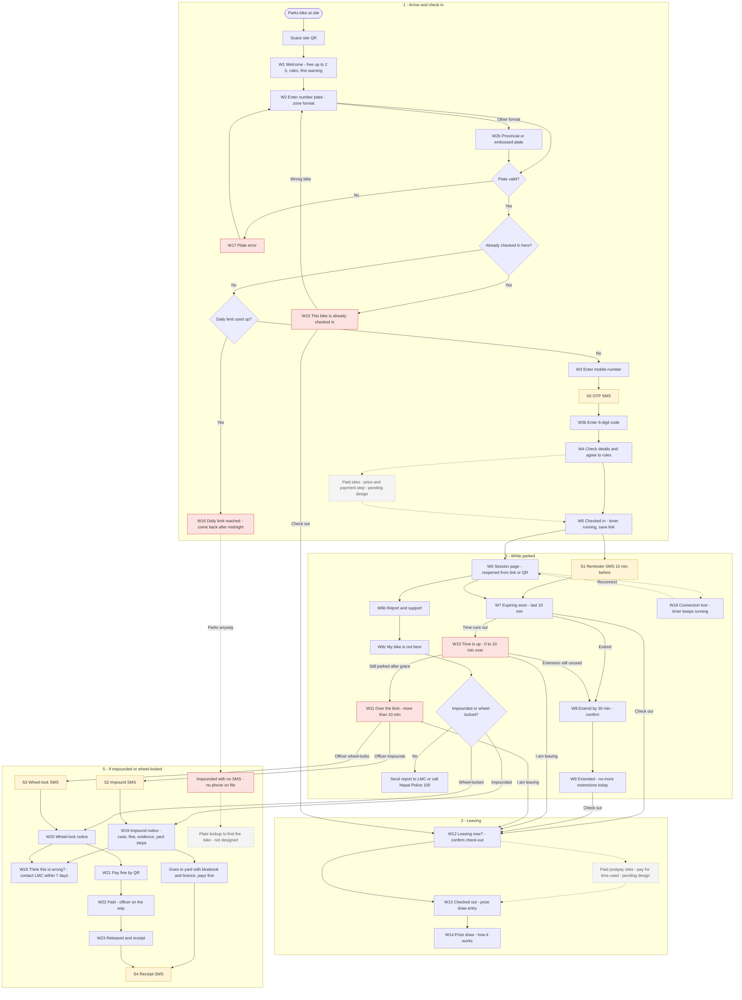

```mermaid
flowchart TD
  classDef sms fill:#fff4d6,stroke:#c9a227,color:#333
  classDef pending fill:#f4f4f4,stroke:#999,stroke-dasharray: 5 5,color:#555
  classDef bad fill:#fde2e2,stroke:#c0392b,color:#333

  subgraph ARRIVE["1 - Arrive and check in"]
    A0(["Parks bike at site"]) --> A1["Scans site QR"]
    A1 --> W1["W1 Welcome - free up to 2 h, rules, fine warning"]
    W1 --> W2["W2 Enter number plate - zone format"]
    W2 -->|"Other format"| W2b["W2b Provincial or embossed plate"]
    W2 --> PV{"Plate valid?"}
    W2b --> PV
    PV -->|"No"| W17["W17 Plate error"]:::bad
    W17 --> W2
    PV -->|"Yes"| AC{"Already checked in here?"}
    AC -->|"Yes"| W15["W15 This bike is already checked in"]:::bad
    W15 -->|"Wrong bike"| W2
    AC -->|"No"| DL{"Daily limit used up?"}
    DL -->|"Yes"| W16["W16 Daily limit reached - come back after midnight"]:::bad
    DL -->|"No"| W3["W3 Enter mobile number"]
    W3 --> S0["S0 OTP SMS"]:::sms
    S0 --> W3b["W3b Enter 6-digit code"]
    W3b --> W4["W4 Check details and agree to rules"]
    W4 -.-> PAYIN["Paid sites - price and payment step - pending design"]:::pending
    W4 --> W5["W5 Checked in - timer running, save link"]
    PAYIN -.-> W5
  end

  subgraph PARKED["2 - While parked"]
    S1["S1 Reminder SMS 10 min before"]:::sms
    W6["W6 Session page - reopened from link or QR"]
    W6b["W6b Report and support"]
    W6c["W6c My bike is not here"]
    REC{"Impounded or wheel-locked?"}
    RPT["Send report to LMC or call Nepal Police 100"]
    W7["W7 Expiring soon - last 10 min"]
    W8["W8 Extend by 30 min - confirm"]
    W9["W9 Extended - no more extensions today"]
    W10["W10 Time is up - 0 to 10 min over"]:::bad
    W11["W11 Over the limit - more than 10 min"]:::bad
    W18["W18 Connection lost - timer keeps running"]
  end
  W5 --> W6
  W5 --> S1
  S1 --> W7
  W6 --> W6b
  W6b --> W6c
  W6c --> REC
  REC -->|"No"| RPT
  W6 --> W7
  W7 -->|"Extend"| W8
  W8 --> W9
  W7 -->|"Time runs out"| W10
  W10 -->|"Extension still unused"| W8
  W10 -->|"Still parked after grace"| W11
  W6 -.-> W18
  W18 -.->|"Reconnect"| W6

  subgraph LEAVE["3 - Leaving"]
    W12["W12 Leaving now? - confirm check-out"]
    PAYOUT["Paid postpay sites - pay for time used - pending design"]:::pending
    W13["W13 Checked out - prize draw entry"]
    W14["W14 Prize draw - how it works"]
  end
  W7 -->|"Check out"| W12
  W9 -->|"Check out"| W12
  W10 -->|"I am leaving"| W12
  W11 -->|"I am leaving"| W12
  W15 -->|"Check out"| W12
  W12 -.-> PAYOUT
  PAYOUT -.-> W13
  W12 --> W13
  W13 --> W14

  subgraph ENF["5 - If impounded or wheel-locked"]
    S2["S2 Impound SMS"]:::sms
    W19["W19 Impound notice - case, fine, evidence, yard steps"]
    W24["W24 Think this is wrong? - contact LMC within 7 days"]
    YARD["Goes to yard with bluebook and licence, pays fine"]
    S3["S3 Wheel-lock SMS"]:::sms
    W20["W20 Wheel-lock notice"]
    W21["W21 Pay fine by QR"]
    W22["W22 Paid - officer on the way"]
    W23["W23 Released and receipt"]
    S4["S4 Receipt SMS"]:::sms
    NOSMS["Impounded with no SMS - no phone on file"]:::bad
    LOOKUP["Plate lookup to find the bike - not designed"]:::pending
  end
  W11 -->|"Officer impounds"| S2
  W11 -->|"Officer wheel-locks"| S3
  W16 -.->|"Parks anyway"| NOSMS
  NOSMS -.-> LOOKUP
  REC -->|"Impounded"| W19
  REC -->|"Wheel-locked"| W20
  S2 --> W19
  W19 --> YARD
  W19 --> W24
  YARD --> S4
  S3 --> W20
  W20 --> W24
  W20 --> W21
  W21 --> W22
  W22 --> W23
  W23 --> S4
```