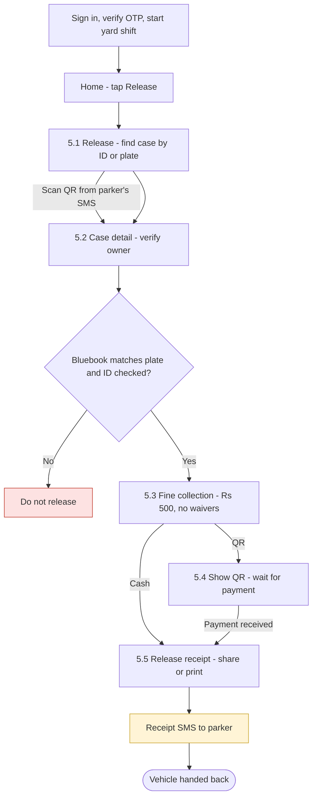

```mermaid
flowchart TD
  classDef sms fill:#fff4d6,stroke:#c9a227,color:#333
  classDef bad fill:#fde2e2,stroke:#c0392b,color:#333

  Y0["Sign in, verify OTP, start yard shift"] --> Y14["Home - tap Release"]
  Y14 --> Y51["5.1 Release - find case by ID or plate"]
  Y51 -->|"Scan QR from parker's SMS"| Y52
  Y51 --> Y52["5.2 Case detail - verify owner"]
  Y52 --> DOCS{"Bluebook matches plate and ID checked?"}
  DOCS -->|"No"| STOP["Do not release"]:::bad
  DOCS -->|"Yes"| Y53["5.3 Fine collection - Rs 500, no waivers"]
  Y53 -->|"Cash"| Y55
  Y53 -->|"QR"| Y54["5.4 Show QR - wait for payment"]
  Y54 -->|"Payment received"| Y55["5.5 Release receipt - share or print"]
  Y55 --> SMS["Receipt SMS to parker"]:::sms
  SMS --> OUT(["Vehicle handed back"])
```